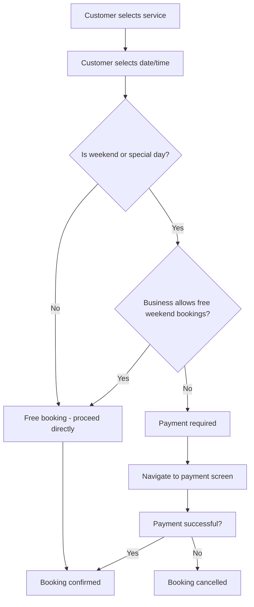
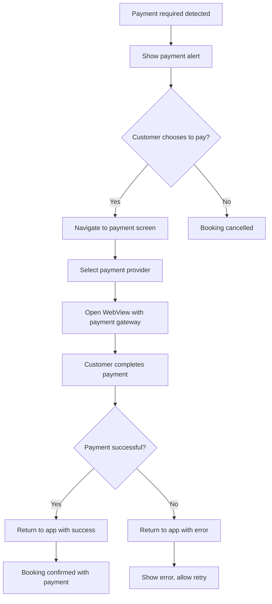
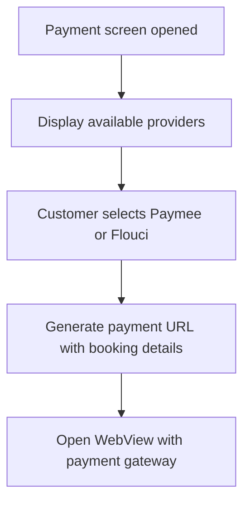
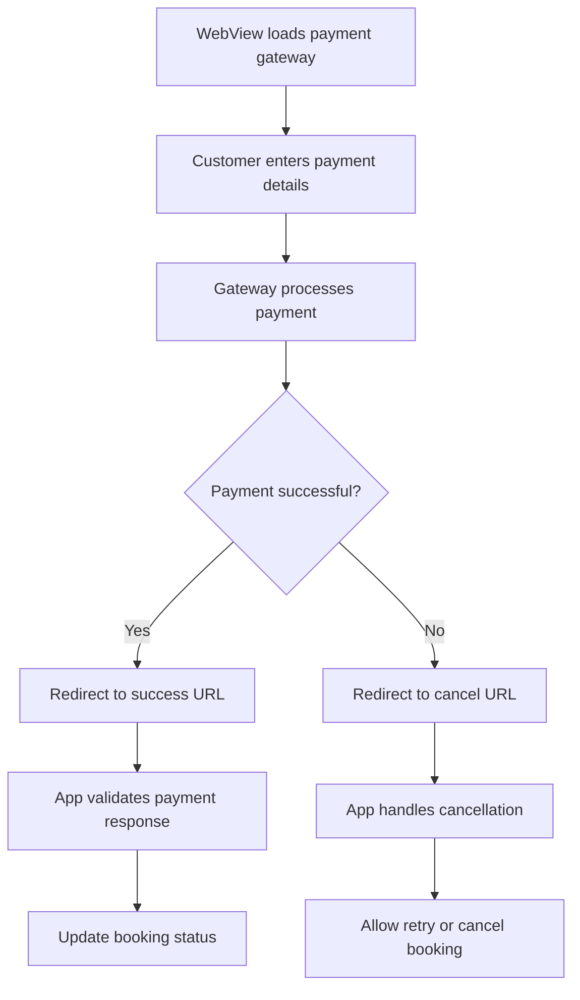
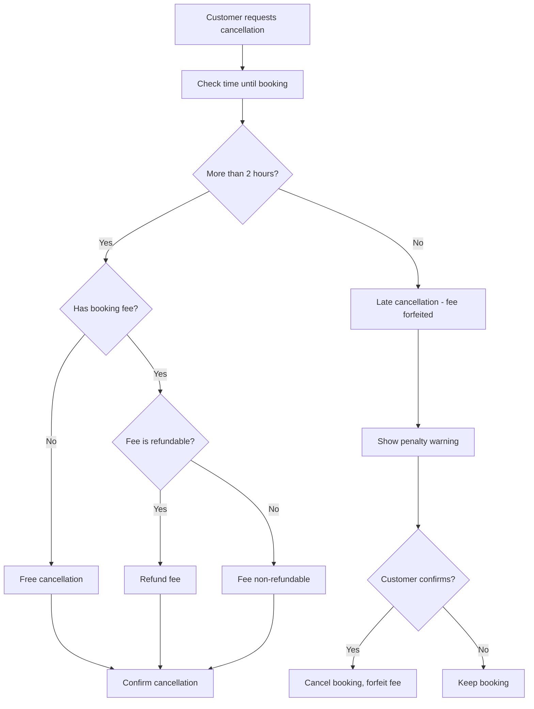
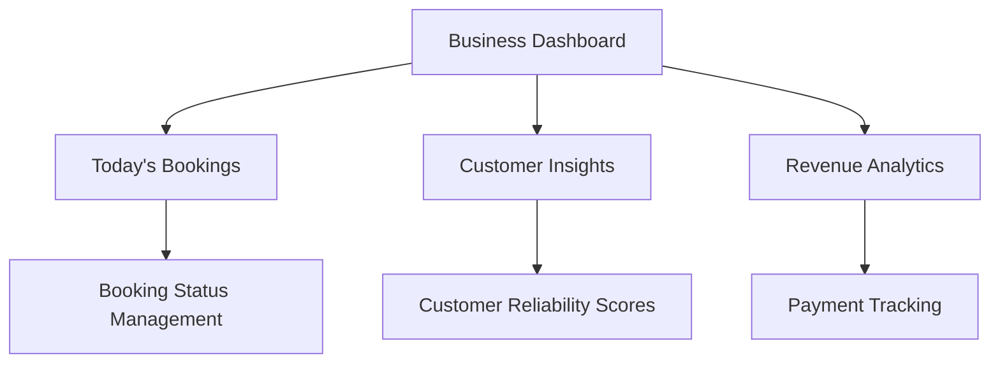
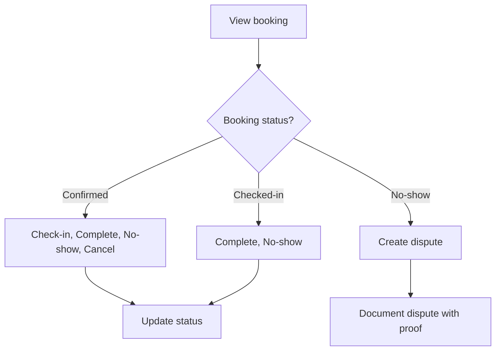
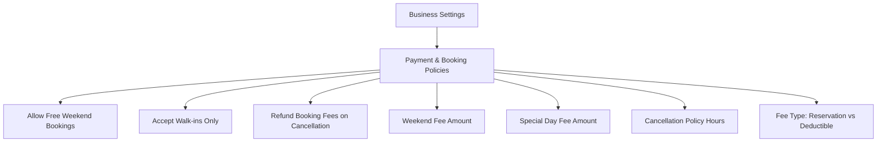

# Reservili App - Workflow Documentation

## Overview

This document outlines all the workflows in the Reservili appointment booking app, including customer flows, business flows, payment processing, and cancellation policies.

## Table of Contents

1. [Customer Booking Flow](#customer-booking-flow)
2. [Payment Processing Flow](#payment-processing-flow)
3. [Cancellation Flow](#cancellation-flow)
4. [Business Management Flow](#business-management-flow)
5. [Customer Reliability System](#customer-reliability-system)
6. [Business Policy Configuration](#business-policy-configuration)

---

## Customer Booking Flow

### 1. Free Booking (Default)



### 2. Paid Booking Flow



---

## Payment Processing Flow

### 1. Payment Provider Selection



### 2. Secure Payment Processing



### 3. Payment Types

- **Reservation Fee**: Non-refundable fee to secure booking
- **Deductible**: Amount deducted from final bill

---

## Cancellation Flow

### 1. Cancellation Policy Check



### 2. Cancellation Scenarios

- **Early cancellation (>2 hours)**: Full refund if fee is refundable
- **Late cancellation (<2 hours)**: Fee forfeited, booking cancelled
- **Free bookings**: No penalty, just cancellation confirmation

---

## Business Management Flow

### 1. Dashboard Overview



### 2. Booking Management



---

## Customer Reliability System

### 1. Reliability Score Calculation

```
Reliability Score = 100 - (No-show Rate × 2) - Cancellation Rate

Rating Levels:
- Excellent: 90-100%
- Good: 75-89%
- Fair: 60-74%
- Poor: <60%
```

### 2. Reliability Factors

- **Total Bookings**: Historical booking count
- **No-show Count**: Times customer didn't show up
- **Cancellation Count**: Times customer cancelled
- **Timing**: Late cancellations weighted more heavily

---

## Business Policy Configuration

### 1. Payment Policies



### 2. Policy Options

- **Allow Free Weekend Bookings**: Toggle for weekend payment requirement
- **Accept Walk-ins Only**: Disable advance bookings
- **Refund Policy**: Whether to refund fees on timely cancellation
- **Fee Amounts**: Configurable amounts for weekends and special days
- **Cancellation Window**: Hours before booking to cancel without penalty
- **Fee Type**: Reservation fee (non-refundable) vs deductible (from bill)

---

## Special Days Configuration

### 1. Default Special Days (Tunisia)

- New Year's Day (January 1)
- Independence Day (March 20)
- Martyrs' Day (April 9)
- Labour Day (May 1)
- Republic Day (July 25)

### 2. Custom Special Days

Businesses can add custom special days with:

- Date
- Name/Description
- Payment requirement
- Custom fee amount

---

## Error Handling & Edge Cases

### 1. Payment Failures

- Network connectivity issues
- Payment gateway errors
- Insufficient funds
- Card declined

### 2. Booking Conflicts

- Time slot no longer available
- Business closed
- Capacity reached

### 3. Cancellation Edge Cases

- Booking already started
- Multiple rapid cancellations
- System downtime during cancellation

---

## Security Considerations

### 1. Payment Security

- No card data stored in app
- PCI DSS compliant payment gateways
- Secure WebView implementation
- Payment validation on return

### 2. Data Protection

- Customer data encryption
- Secure API communications
- Payment transaction logging
- Dispute documentation

---

## Future Enhancements

### 1. Planned Features

- Subscription tiers for customers
- Advanced analytics dashboard
- Multi-language support
- Push notifications
- Loyalty program integration

### 2. Integration Possibilities

- Calendar sync
- SMS notifications
- Email marketing
- Social media integration
- Third-party payment providers

---

## Technical Implementation Notes

### 1. Key Components

- `PaymentScreen.tsx`: Handles payment provider selection and WebView
- `CancellationScreen.tsx`: Manages cancellation flow and policy display
- `BookingScreen.tsx`: Main booking interface with fee calculation
- `BusinessSettingsScreen.tsx`: Policy configuration interface

### 2. Utility Functions

- `paymentUtils.ts`: Payment processing and validation
- `bookingUtils.ts`: Date logic, fee calculation, cancellation policies
- `customerReliability.ts`: Reliability score calculations

### 3. State Management

- Local state for UI interactions
- API integration for data persistence
- Real-time updates for booking status
- Offline capability considerations

---

_This documentation should be reviewed and updated as features are added or modified._
